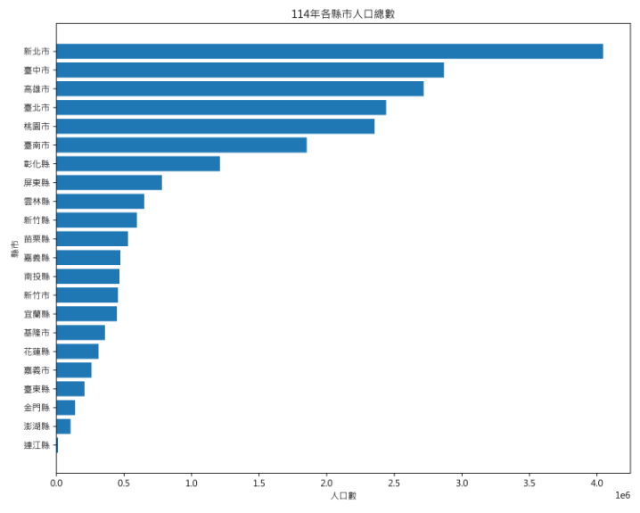
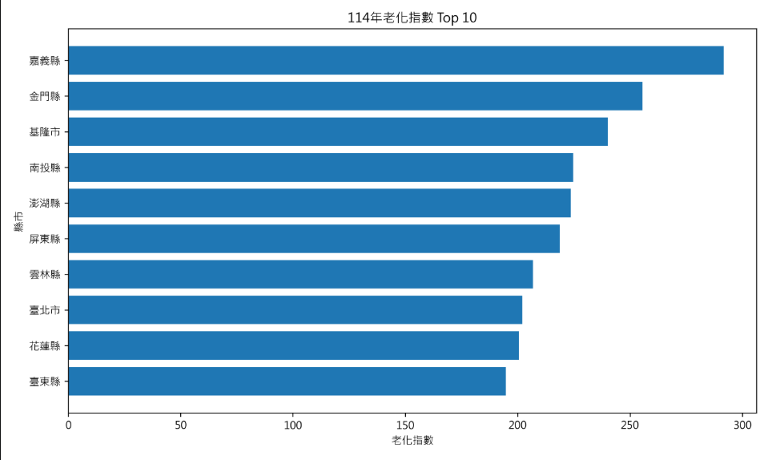
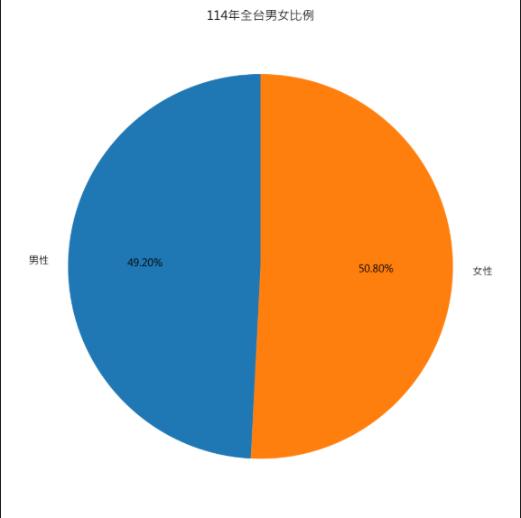
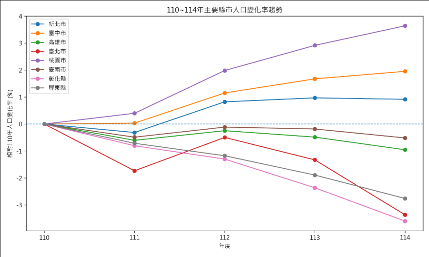

# 1142_final_project
1142期末分組專題規劃與開發日誌
2026/5/27-6/17(共四周)進行各組自訂專題。組別照舊。
2026/6/24進行各組成果發表

* 參考資料集:
確認下載使用的儘量是原始資料（CSV/JSON/TXT），而不是已經整理好的 Excel
1.	[臺灣政府資料開放平台](https://data.gov.tw/datasets/search)
2.	[環境部空氣品質監測資料](https://airtw.moenv.gov.tw/cht/Query/DataDownload.aspx)
3.	[全民健康保險醫療統計](https://dep.mohw.gov.tw/dos/lp-5103-113.html)

2026/5/27 討論想法，結束時，各組提交一頁專題規劃如下:
##  一、專題規劃 (5/27 提交)
* **專題名稱**：台灣人口結構與高齡化分析
* **資料來源**： 內政部戶政司人口統計資料 https://www.ris.gov.tw/app/portal/346
* **主要問題**：分析台灣各縣市人口結構、高齡化程度與人口分布情形，統計各縣市老化指數、男女比例與人口成長趨勢，找出高齡化最嚴重與人口減少最快的地區。
* **次要問題**： 1. 如何處理人口數缺失值與格式錯誤資料
                2. 如何統一縣市名稱格式避免統計錯誤
                3. 如何過濾人口數為0或異常值的資料
                4. 如何依不同年齡層進行人口分群統計
                5. 如何避免CSV欄位缺失導致程式崩潰
* **預期產出圖表**：  1. 各縣市人口總數長條圖
                     2. 各縣市老化指數Top10排名圖
                     3. 男女比例分布圓餅圖
                     4. 人口變化趨勢折線圖
---

##  二、組員分工紀錄 (佔比 10%)
| 學號 | 姓名 | 主要負責模組 / 任務描述 | 預估貢獻度 (%) |
| 112316110 | 徐語楨 | main.py、analyzer.py / 負責系統主流程、人口統計分析功能、分析結果輸出 | 35% |
| 112316131 | 黃于恩 | data_cleaner.py、data_loader.py / 負責CSV資料讀取、多年度資料整合、資料清理、資料格式轉換、人口資料驗證及人口結構欄位建置 | 35% |
| 113106102 | 陳元隆 | visualizer.py、下載csv檔數據 / 負責戶政司資料蒐集與下載、圖表視覺化設計、圖表輸出與結果呈現| 30% |

112316131黃于恩期末專題心得:
在這次期末專題中，我主要負責data_loader.py與data_cleaner.py模組的開發，工作內容包含人口統計資料的讀取、多年度資料整合、資料清理、格式轉換以及資料驗證等。由於期中專題時已經接觸過模組化程式設計，因此這次在架構規劃上相對熟悉許多，也能更有系統地將不同功能拆分成獨立模組進行開發。不過，雖然程式架構與期中專題有些相似，但本次處理的資料量與資料格式複雜度明顯更高，因此仍然遇到不少新的挑戰。
在資料讀取的部分，我原本認為政府開放資料應該已經具備統一格式，只需要讀取CSV檔案即可進行分析。然而實際下載內政部戶政司的人口統計資料後，才發現不同年份的資料存在許多差異，例如有些檔案採用UTF-8編碼，有些則使用CP950編碼，如果沒有額外處理便容易產生讀取失敗的問題。此外，部分原始檔案前面還包含說明文字與非正式表頭，因此需要先進行判斷與篩選，才能正確取得真正的資料內容。透過這些實作經驗，我更加理解真實資料與課堂範例之間的差異，也學習到資料前處理在分析流程中的重要性。
本次專題中最具挑戰性的部分是資料清理。原始人口統計資料的排版方式相當特殊，每個縣市的人口資訊會依照「計」、「男」、「女」三列排列，但只有中間的「男」那一列記錄了縣市名稱，其餘兩列則為空白。起初我們曾嘗試使用較簡單的資料填補方式處理，但實際驗證後發現容易導致縣市資料錯位，使統計結果出現明顯誤差。後來透過反覆檢查原始資料格式與測試結果，我重新設計資料整理邏輯，以索引方式將三列資料視為同一筆紀錄進行處理，再加入人口加總驗證機制，確保資料正確性。這個過程讓我深刻體會到資料清理往往比後續分析更花時間，也更考驗程式設計能力。
在測試階段，我們也刻意修改原始資料，模擬空值、非數字內容、人口數為零以及編碼格式錯誤等情況，檢查程式是否具備足夠的穩健性。為了避免程式因異常資料而中斷，我在資料清理函式中加入例外處理與驗證機制，讓程式能夠自動跳過或修正不合理的資料。透過這些測試，我學習到撰寫程式不應只考慮正常情況，更應提前思考可能發生的錯誤與例外狀況，提升整體系統的可靠性。
除了程式開發之外，我也持續練習Git的使用。相較於期中專題，這次對commit、push與pull的操作更加熟悉，也逐漸了解版本控制在團隊協作中的重要性。透過Git的紀錄功能，不僅能追蹤每次修改內容，也能降低多人共同開發時產生衝突的風險，讓專案管理更加有效率。
整體而言，這次期末專題讓我將期中所學的程式設計概念進一步實際應用到較完整的資料分析流程中。除了提升Python與Pandas的操作能力之外，也讓我累積了處理真實資料、進行資料驗證以及團隊協作開發的經驗。透過這次專題，我更了解資料分析工作的實際流程，也對未來進一步學習資料科學與資料工程相關技術產生更大的興趣。
---

## 三、數據自我測試紀錄 (佔比 25%)
> **重要規範**：請手動修改 `data/` 中的原始檔案，測試程式的「穩健性」。若程式因髒數據直接崩潰（Crash），此項不計分。

| 測試情境 | 模擬動作 (如何「弄壞」數據) | 程式原始反應 | 修正後邏輯與檔案位置 |
| 人口數缺失 | 將某縣市人口欄位改成空白 | int()轉換失敗，可能造成錯誤 | 在data_cleaner.py的to_number()中，空值直接回傳0 |
| 人口數含文字 | 將人口數改成ABC | ValueError | to_number() 使用try except，錯誤直接回傳 0 |
| 縣市欄位空白 | 刪除縣市名稱 | 男女人口列找不到縣市 | 使用ffill()補齊同年度縣市名稱 |
| 人口數為0 | 將某縣市總人口改成0 | 影響統計結果 | 過濾total<=0的資料 |
| CSV非UTF-8 | 改成Big5編碼 | UnicodeDecodeError | 先讀UTF-8，失敗改讀cp950 |

---

##  四、AI 協作與糾錯紀錄 (佔比 10%)
1.  **關鍵 Prompt**：
Python架構分成main.py、data_loader.py、data_cleaner.py、analyzer.py、visualizer.py。目前在讀取內政部人口統計CSV時，發現不同年份的中文編碼不統一（有UTF-8也有CP950)，且前幾行不是標準欄位。叫AI設計符合『不使用全域變數、利用return傳遞數據、限用相對路徑』和解決原始資料可能有空白的排版問題。
    
2.  **AI 代碼失效紀錄與人工修正**：
* **失效說明**
失效說明:在處理內政部戶政司的原始人口統計CSV時，我們遇到了整個專案最大的資料清理瓶頸。當初請AI協助生成第一版data_cleaner.py時，AI的寫法相當理想化，採用for_, row in raw_df.iterrows():逐行盲讀資料，並認為既然原始表格存在大量空白縣市欄位，只要在轉成DataFrame後呼叫df.groupby("year")["city"].ffill()進行前向填補即可。
然而，當我們實際比對產出數據時，發現各縣市的人口總量出現嚴重錯亂。經組員對照原始CSV，才發現內政部原始資料的排版結構非常奇特：每一個縣市的統計資料會依序以「計（總人口）」、「男」、「女」連續三行呈現。但詭異的是，只有中間「男」那一行的第一欄寫有真正的縣市名稱，前後「計」與「女」的縣市欄位全部都是完全空白。
這導致舊版程式碼直接破功。如果使用由上往下填補的ffill()，排在最前面的「計（總人口）」非但沒有補到該縣市的名字，反而會錯誤地抓到「上一個縣市」末尾留下來的有名稱資料（例如把新北市的總人口算到臺北市頭上），造成所有數據錯位污染。

 * **人工修正方法**
解決隱形空白的防禦寫法：在清理縣市名稱的clean_city_name() 函式時，我們發現有些格子看起來是空的，其實裡面被塞了全形空白或縮排。舊版程式雖然用了.replace()和.strip()把空格拔掉，但它會變成空字串""，這在pandas裡面並不會被當成漏填的資料。所以我們手動補了一行：if name == "": return np.nan。只要變成了純空字串，就強制把它轉成標準的NaN，直接在第一關就把這些髒數據擋掉。

男生那一列的三行綁定機制：我們放棄了舊版那種直接用ffill() 往下自動填滿的偷懶做法，改用iloc配合迴圈。因為只有「男」那一列有寫縣市名字，所以我們把「男」當成關鍵指引。只要程式抓到這一列是有效縣市而且性別是「男」，就用索引同時往上抓一行的「計」，再往下抓一行的「女」。必須這三行剛好湊成「計、男、女」的一組套裝，程式才會呼叫make_record()幫我們把整組資料乾乾淨淨地存下來。

男女人口加總的雙重檢查：
為了保證資料絕對正確、程式不會亂跑，我們在新版程式裡還自己加了一個防呆：abs(total_value-(male_value+female_value))>5。是只要發現原始資料裡的「總人口」跟「男生＋女生」的數字對不起來、誤差超過5個人以上，程式就會在終端機跳出警告並把這筆資料丟掉。

---

## 五、專題執行結果呈現 (佔比 15%)
> 請將產出的 4 張圖表存於 `results/`，並在此處進行分析簡述。

1.  **圖表一 (名稱)**：各縣市人口總數長條圖
    * 
    比較各縣市人口規模差異
2.  **圖表二 (名稱)**：各縣市老化指數Top10排名圖
    * 
    找出高齡化最嚴重的前10名地區
3.  **圖表三 (名稱)**：男女比例分布圓餅圖
    * 
    呈現全台男性與女性人口比例
4.  **圖表四 (名稱)**：人口變化趨勢折線圖
    * 
    觀察110至114年主要縣市人口變化趨勢

---

## 教師評分區 (學生請勿填寫)
* **模組化程式結構 (25%)**： (Parser/Logic/Plotter 拆分情形)
* **Git 使用紀錄 (15%)**： (須滿足至少 10 個具備具體描述的 Commit)
* **成果展示 (10%)**：
* **程式碼理解 Q&A (10%)**： (現場即時修改參數測試)

---
### 注意事項 (必讀)
1.  **路徑規範**：禁止使用 `C:\\Users\\...` 絕對路徑。
2.  **模組契約**：各模組間應透過 `return` 傳遞數據，嚴禁大量使用 Global 變數。
3.  **Git 規範**：禁止一次性 Push 全部代碼，必須有開發過程紀錄。